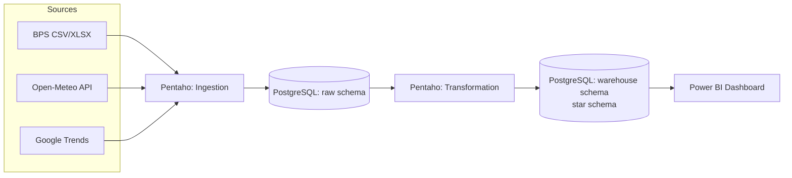
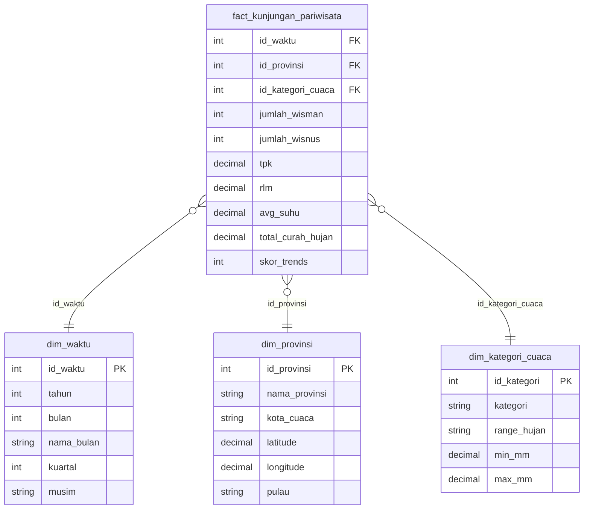

# An End-to-End Data Engineering Pipeline for Correlating Seasonal Weather Patterns and Tourism Demand in Indonesia


## Background

Tourism contributed 4.67% to Indonesia's national GDP in 2023, but visitation is heavily influenced by weather conditions, and no unified data infrastructure previously existed to integrate seasonal weather data and online search trends as explanatory factors for provincial-level visitation. This project addresses that gap.

Three heterogeneous data sources were integrated, each serving a distinct analytical role:

- **BPS (Statistics Indonesia)**: the outcome variable: monthly foreign/domestic visitor counts and hotel occupancy rates
- **Open-Meteo Historical Weather API**: the explanatory environmental variable: daily precipitation and temperature
- **Google Trends**: the behavioral leading-indicator signal: weekly search-interest score

Five provinces were selected via purposive sampling to span four major island groups and represent diverse tourism profiles: **Bali** (international-dominant), **Jawa Timur** (domestic-dominant), **DI Yogyakarta** (heritage-based), **Nusa Tenggara Barat** (nature-based), and **Sumatera Selatan** (low foreign-visitor profile).

## Architecture

The pipeline follows a layered architecture: data sources → ingestion → transformation → warehouse → dashboard, orchestrated through a single Pentaho job scheduled to run monthly.



## Star schema



## Tech stack

- **Pentaho Data Integration (PDI)**: visual, low-code ETL, chosen for its ability to inspect/debug transformations and produce documentation-ready canvas screenshots
- **PostgreSQL**: data warehouse, `raw` and `warehouse` schemas, chosen for relational integrity and native `generate_series`/window function support
- **Python**: two lightweight extraction scripts (`fetch_openmeteo.py`, `fetch_google_trends.py`)
- **Power BI**: two-page interactive dashboard (National Overview, External Factor)
- **Windows Task Scheduler**: monthly automation of the Pentaho job via `kitchen`

## Repository structure

```
tourism-weather-analytics-pentaho/
├── pentaho/
│   ├── ingest_bps.ktr
│   ├── ingest_cuaca.ktr
│   ├── ingest_trends.ktr
│   ├── transformation_bps.ktr
│   ├── transformation_cuaca.ktr
│   ├── transformation_trends.ktr
│   ├── transformation_master.ktr
│   ├── data_quality.ktr
│   └── etl_pariwisata_job.kjb
├── sql/
│   ├── PostgreSQL_DDL.sql        # raw schema
│   └── Star_Schema_DDL.sql       # warehouse schema + star schema
├── scripts/
│   ├── fetch_openmeteo.py
│   └── fetch_google_trends.py
├── data/raw/                     # BPS CSV/XLSX exports
├── dashboard/                    # Power BI .pbix
└── docs/
    └── paper.pdf
```

## Setup

1. Create a PostgreSQL database and run `sql/PostgreSQL_DDL.sql` (raw schema) followed by `sql/Star_Schema_DDL.sql` (warehouse schema and star schema)
2. Run `scripts/fetch_openmeteo.py` and `scripts/fetch_google_trends.py` to populate `data/raw/`
3. Open the `.ktr`/`.kjb` files in Pentaho Data Integration (Spoon), configure the PostgreSQL connection
4. Run `etl_pariwisata_job.kjb` via Spoon or `kitchen etl_pariwisata_job.kjb` from the command line
5. Open `dashboard/*.pbix` in Power BI Desktop, point the data source at the `warehouse` schema

## Data quality

Six sequential checks implemented as Filter Rows steps in the transformation pipeline: not-null on visitor counts and temperature, valid ranges for occupancy rate (0–100%), temperature (15–45°C, consistent with the tropical target provinces), and rainfall (non-negative), a uniqueness check on province-year-month, and referential integrity against `dim_provinsi`. Rows failing any check are routed to `warehouse.log_data_quality`, recording the source, affected province/period, and rejection reason.

After the full pipeline run, the fact table contained 178 rows (two short of the 180-row target), due to BPS not yet publishing November–December 2025 figures for NTB at the time of data collection.

## Findings

1. **Rainfall and visitor correlation**: negative association clearest for NTB and Bali (outdoor/beach/trekking-dependent tourism); Jawa Timur and Sumatera Selatan show weaker sensitivity, consistent with their domestic-tourist-dominated visitor base.
2. **Peak season by province**: Jawa Timur peaks in April and December (school/national holidays, calendar-driven); Bali stays comparatively stable year-round (international, less tied to the Indonesian school calendar); NTB peaks May–October, the dry season (nature/beach tourism, weather-driven).
3. **Google Trends as a leading indicator**: the trends score, lagged by one month, consistently precedes turning points in actual visitation across 2023–2025.
4. **Provincial weather sensitivity**: Sumatera Selatan shows the strongest growth (+43.7%) despite low weather sensitivity; NTB shows the steepest decline (-10.9%) alongside high weather sensitivity; Jawa Timur shows a small decline (-0.7%) and weak sensitivity.

## Authors

* Zafira Zefina Zein
* Amalia Azzahra
* Naura Khairina Kalila
* Atiqah Zahra Pramudya
* Wendy Lanjaya
